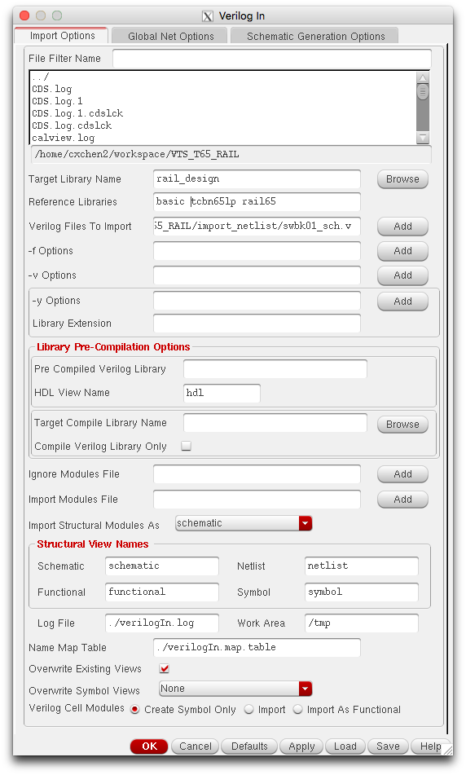
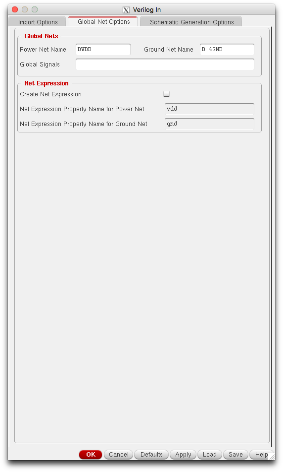
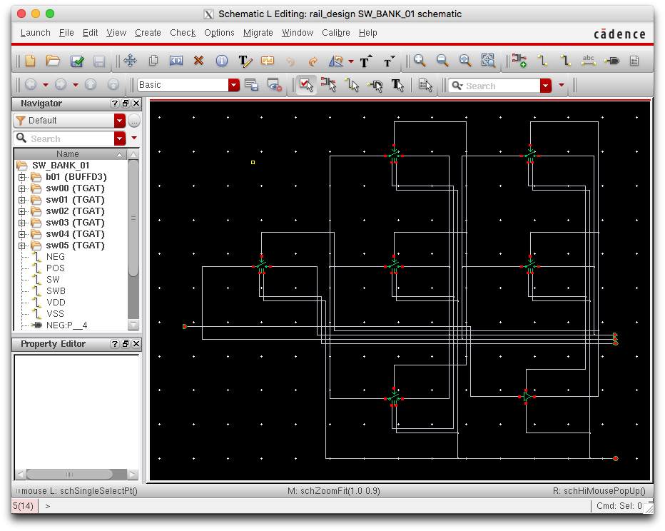
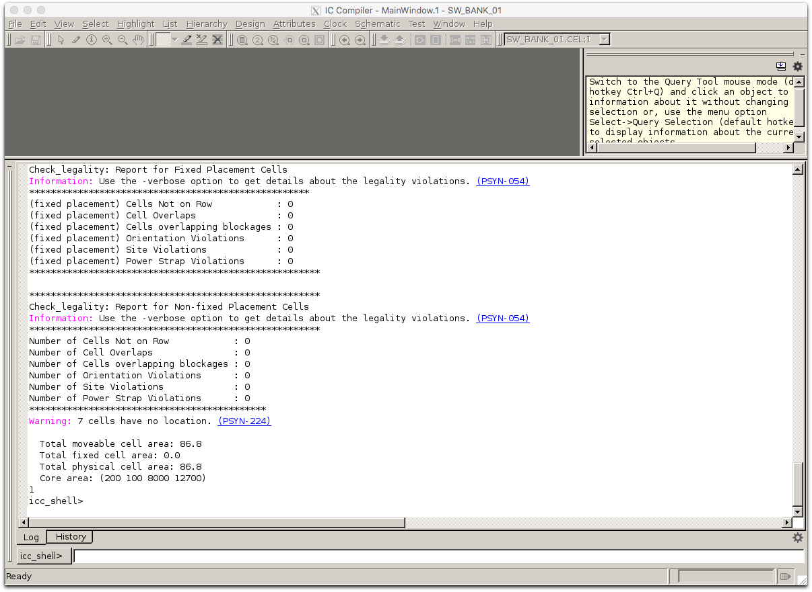
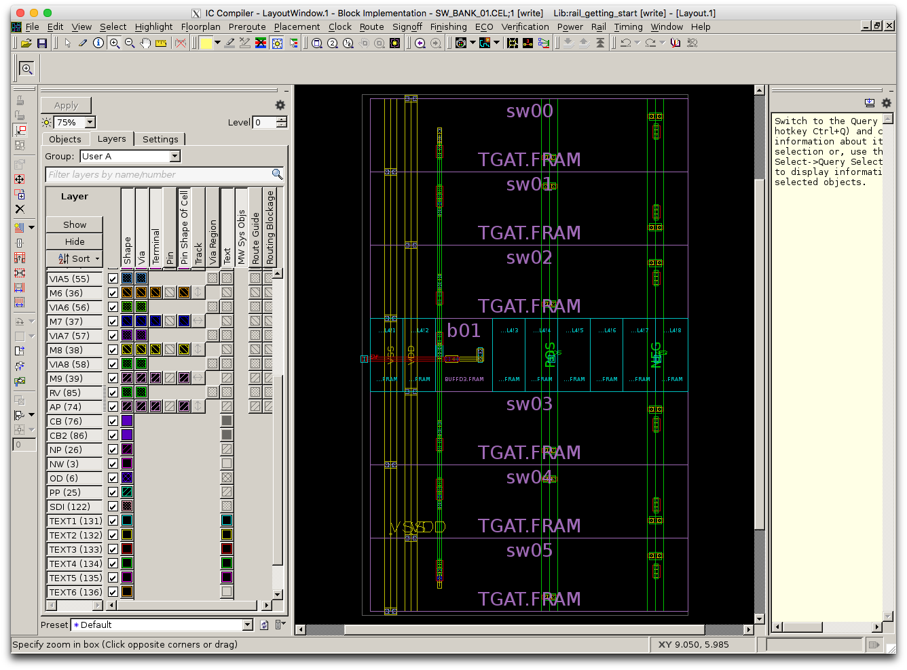
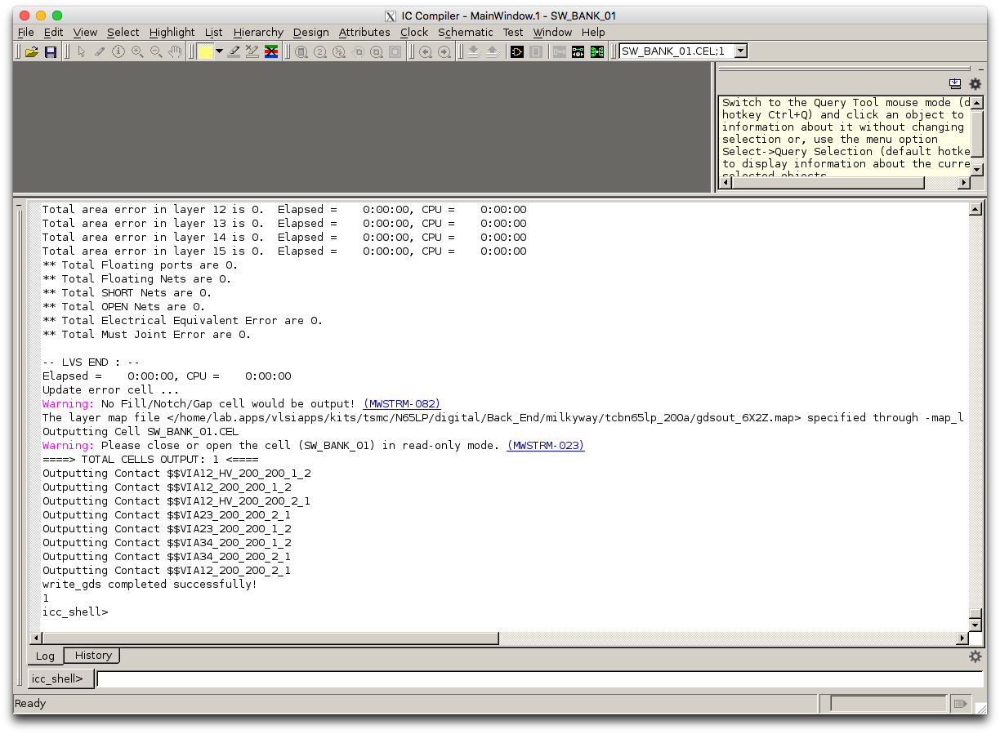
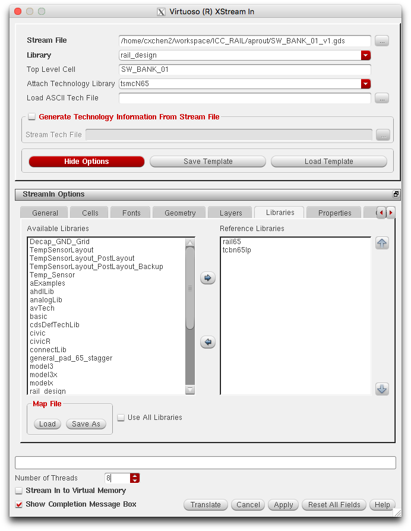
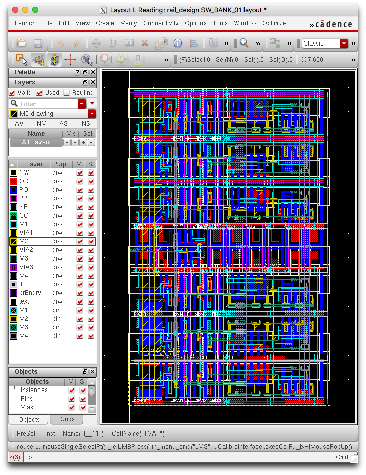
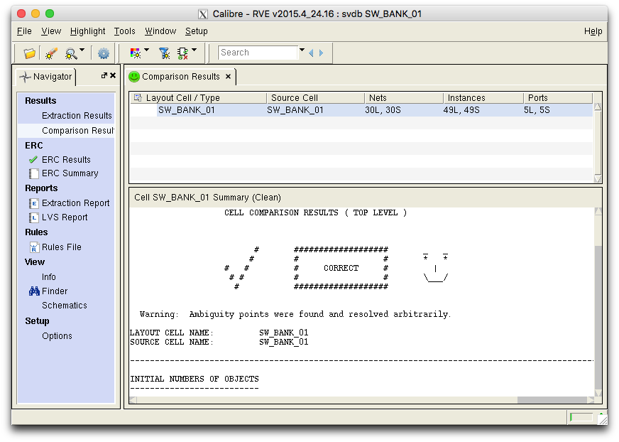

=================================
Tutorial for RAIL Getting Started
=================================

**Author**：Chixiao Chen

This a simple tutorial on how to implement a RAIL flow to design an AMS module from scratch to a LVS/DRC clean GDS.
To reveil the truth of RAIL, we illustrate the RAIL flow step by step, rather than providing a makefile based fully automatic flow.

To begin with, we need to download the following files from RAIL/rail65 repo, unzip if necessary, and put them onto your VLSI design server,

- analog/cdk_oa/rail.zip cds.lib
- digital/front_end/rail65.db
- digital/backe_end/FRAM_only/rail65.zip
- analog/gds/rail65.gds (This file is not open for download due to NDA issues, plz contact rail4open@gmail.com to get them).

To complete the sample, please confirm your enviroment already have installed Cadence IC6, Synopsys ICC and Mentor Calibre.

Step 1: Load a Verilog Netlist
~~~~~~~~~~~~~~~~~~~~~~~~~~~~~~~~~
In this example, we are going to design a CMOS transmission gate whose on-resistance is less than 200 Ohm at 0.6V operating point. We are going to use the RAIL cell, TGAT, and some digital gate from standard cell library.
The RAIL compiler will generate a verilog based netlist as follow, 

.. code-block:: Verilog

   // File: swbk01.v
   `timescale 1ns/1ps
   module module SW_BANK_01 (
     input  SW,
     output POS, NEG 
     );
     BUFFD3 b01  (.I(SW),.Z(SWB));
     TGAT   sw00 (.SW(SWB),.POS(POS),.NEG(NEG));
     TGAT   sw01 (.SW(SWB),.POS(POS),.NEG(NEG));
     TGAT   sw02 (.SW(SWB),.POS(POS),.NEG(NEG));
     TGAT   sw03 (.SW(SWB),.POS(POS),.NEG(NEG));
     TGAT   sw04 (.SW(SWB),.POS(POS),.NEG(NEG));
     TGAT   sw05 (.SW(SWB),.POS(POS),.NEG(NEG));
   endmodule

The design paralles 6 TGAT cells, which are drived by BUFFD3 from standard cell. The top cell name is named as *SW_BANK_01*.
The verilog file can be found under the RAIL repo, rail65/sample_getting_started .

Step 2: Generate an OA-based Schematic
~~~~~~~~~~~~~~~~~~~~~~~~~~~~~~~~~~~~~~

Modify the netlist with the power supply ports,

.. code-block:: Verilog

   // File: swbk01_sch.v
   `timescale 1ns/1ps
   module SW_BANK_01 (
     inout  VDD,VSS,  // Power supply ports
     input  SW,
     output POS, NEG
     );
     BUFFD3 b01  (.I(SW),.Z(SWB), .VDD(VDD),.VSS(VSS));
     TGAT   sw00 (.SW(SWB),.POS(POS),.NEG(NEG), .VDD(VDD),.VSS(VSS));
     TGAT   sw01 (.SW(SWB),.POS(POS),.NEG(NEG), .VDD(VDD),.VSS(VSS));
     TGAT   sw02 (.SW(SWB),.POS(POS),.NEG(NEG), .VDD(VDD),.VSS(VSS));
     TGAT   sw03 (.SW(SWB),.POS(POS),.NEG(NEG), .VDD(VDD),.VSS(VSS));
     TGAT   sw04 (.SW(SWB),.POS(POS),.NEG(NEG), .VDD(VDD),.VSS(VSS));
     TGAT   sw05 (.SW(SWB),.POS(POS),.NEG(NEG), .VDD(VDD),.VSS(VSS));
   endmodule

Before launching the virtuoso, make sure cds.lib has been configured correctly that rail65/tsmcN65/tcbn65lp/analogLib/basic can show up in the library manager.

Launch Virtuoso, create a libary named as *rail_design* or any name you want

File --> Import --> Verilog, configure the VerilogIn as follow,

     
The target library is the library you created, the reference library should include basic/tcbn65lp(standard cell)/rail65. 
And most importantly, add the verilog netlist.
To avoid global pin mess, we recommand filling out some name different from your power/gound pin, as shown below

     
Click the OK or Apply. Virtuoso supports a structual verilog schematic generation. If verilog imports successfully, you will see a new schemtaic in the *rail_design* library, thought the wires are ugly.

     
The generated schematic can be used for pre-layout simulation and LVS. 

Step 3: Generate an Milkyway-based Physcal Design
~~~~~~~~~~~~~~~~~~~~~~~~~~~~~~~~~~~~~~~~~~~~~~~~~

Now we are ready to create the transmission gate layout by the digital flow. In the example, we are using IC Compiler from Synopsys. 

First, let us config all the path needed in the *0_def.tcl* file.

.. code-block:: tcl

  # File: 0_def.tcl
  # The milkyway lib path and input/output path
  set LIBR_PATH mw_proj/rail_getting_start
  set RTL_PATH    rtl/swbk01.v
  set MODULE_NAME SW_BANK_01
  set VERSION     _v1
  set GDS_PATH aprout/$MODULE_NAME$VERSION.gds

  # The backend files provided by foundry and RAIL project
  set TECHFILE_PATH  /.../tsmcn65_9lmT2.tf
  set STDCELL_DB_PATH /.../tcbn65lp_200a
  set RAILIB_DB_PATH /../digital/front_end/ # where rail65.db is stored
  ....
  
  # The physical information set, including floorplan area and allowed routing metal
  set TILE_HT 1.8
  set TILE_WD 0.2
  set CORE_ROW 7
  set CORE_COL 39
  set CORE_HT [expr {$TILE_HT * $CORE_ROW}]
  set CORE_WD [expr {$TILE_WD * $CORE_COL}]
  set TOP_RT_METAL M5

Second, we create a the target design based the verilog list we obtained in step 1. 
The key steps includes

.. code-block:: tcl
  
  # File: 1_create.tcl
  # Create the library, if already exist can open it
  create_mw_lib \
	-technology $TECHFILE_PATH \
	-mw_reference_library  $REFLIB_PATH \
	-open $LIBR_PATH
   
  # Import the Verilog and create the floorplan
  read_verilog -top $MODULE_NAME -allow_black_box $RTL_PATH
  create_floorplan -control_type width_and_height \
		 -core_width  $CORE_WD \
		 -core_height $CORE_HT \
		 -bottom_io2core 0.1 -top_io2core 0.1 -left_io2core 0.2
       
  # First Check
  check_legality
  
If the definition works all good, the results of *check_legality* should have no error, like the screen shot below

     
The next step is placement and routing. In the case, we mark all the steps explicitly. 
Note that the power supply and analog nets are routed manually due to their parasitic sensitivity, 
but the digital nets are done automatically as,

.. code-block:: tcl

   # File: 2_place_route.tcl
   ...
   # This part routing the power and analog manually
   create_power_straps  -direction vertical  -start_at 0.700 -nets  {VSS}  -layer M2 -width 0.3 -look_inside_std_cell
   ...
   # This part routes the digital signal automatically
   set_route_mode_options -zroute true
   ...
   route_zrt_detail
   ...
   
A screenshot is illustrated below for a success placement and routing.

To complete the layout, we will do an LVS check in ICC. 
There should be no erros in this sample.
After that, the layout is going to be exported in the GDS format. 
The script and screenshot of the step is shown below.

.. code-block:: tcl

   # File: 3_signoff.tcl
   # Verify the placement and routing
   verify_lvs
   
   # Export the GDS-II file
   set_write_stream_options -child_depth 0 -skip_ref_lib_cells \
                            -map_layer $MAP_PATH
   write_stream -format gds -cells  $MODULE_NAME $GDS_PATH

     
All the script metioned in the step is avaialbe in the rail65 repo, under the directory of *sample_getting_started*.

Step 4: Merge the GDS and Import to Virtuoso
~~~~~~~~~~~~~~~~~~~~~~~~~~~~~~~~~~~~~~~~~~~~

If your rail65.gds are seperate from the OA database in Virtuoso, you can use *calibredrv* to merge the gds

.. code-block:: none

   calibredrv -a layout filemerge -in SW_BANK_01_v1.gds -indir /../analog/gds -out SW_BANK_01_m1.gds -topcell SW_BANK_01
   
But we highly recommend streaming-in the rail65.gds file to the *rail65* library in virtuoso first. After that, you do not need to do the gds merge. 
The following figure shows the stream-in flow in the virtuoso. Note that the reference lib should include the standard cell lib (tcbn65lp) and the rail library (rail65).

     
A successful layout import will result in a view as follow,

Step 5: RUN the DRC/LVS/PEX and post-simulation
~~~~~~~~~~~~~~~~~~~~~~~~~~~~~~~~~~~~~~~~~~~~~~~

The rest step follows the conventional AMS design follow.
We provide a screenshot of the LVS check in calibre below.
One of the coolest things in RAIL flow is that the layout it generated is **100%** DRC/LVS clean.
There is **NO** worry for unnecessary LVS/DRC debugging in the flow.

